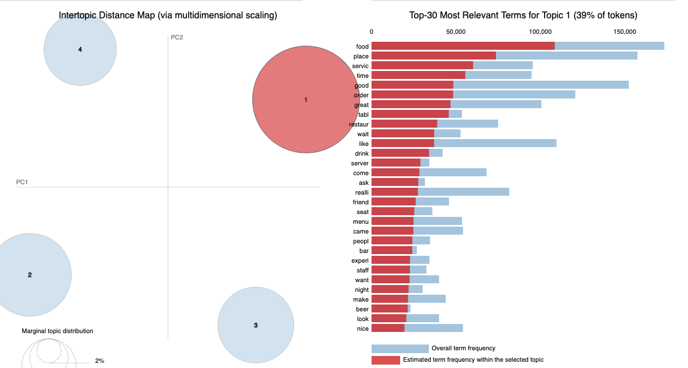
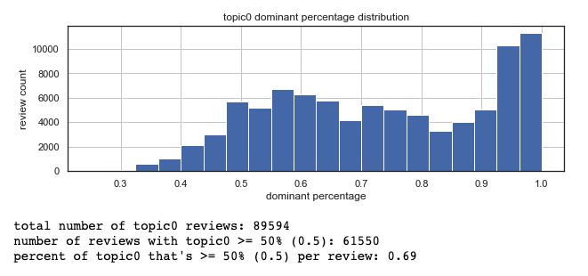
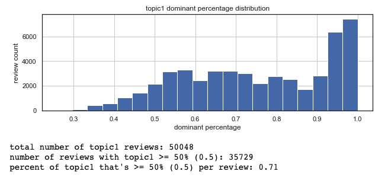
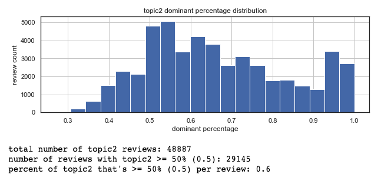
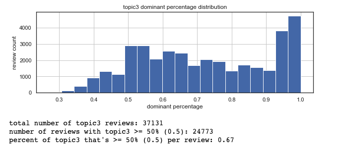
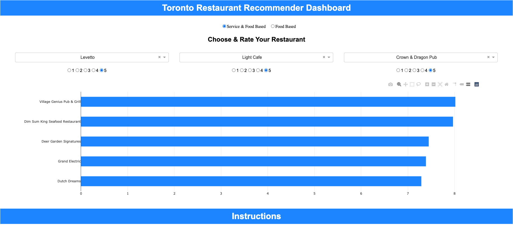

# Food_And_Service_Restaurant_Recommendation_Engine

## Project Description

The analysis explored the Yelp business reviews data set https://www.yelp.com/dataset. 

Filtering for only restaurants and culinary businesses in Toronto, topic modeling was used to cluster data and mine for service-standard reviews. Once the clusters had been generated, singular value decomposition (SVD) was used to create two recommendation engines. One engine for all standard-based reviews (service and food) and another for food standard-based reviews. 

Having completed the above, a recommendation dashboard app using plotly and dash was created. The dashboard allows the user to have the choice if he/she wants to be recommended restaurants basis all standards or simply basis food standards. 

Anyone looking to explore and get a deeper look into Toronto's restaurants can use this app.

## Methods Used

1) Descriptive Statistics - used for preliminary data exploration.
2) Topic Modeling - Used to cluster reviews by their context
3) singular Value Decomposition (SVD) - used to create 2 restaurant recommendation engines basis all standards or food standards 

## Results 

### Descriptive stats after cleaning and data preprocessing 

* **number of businesses** - 911
* **number of users** - 4,045
* **number of reviews** - 100,763

### Topic modeling

* **Topic0 AKA Topic1** - Service
* **Topic1 AKA Topic1** - Food
* **Topic2 AKA Topic1** - Food
* **Topic3 AKA Topic1** - Food

All topics generated represented the reviews they were asigned to by proportions greater then >= 50% 67% of the time.

Topic0 AKA Topic1                     |  Topic1 AKA Topic2
:------------------------------------:|:------------------------------------:
             |  

Topic2 AKA Topic3                     |  Topic3 AKA Topic4
:------------------------------------:|:------------------------------------:
             |  

### Singular Value Decomposition

**All Standards train**:

  * RMSE - 0.94
  * MAE - 0.73

**All Standards test**:

  * RMSE - 0.96
  * MAE - 0.75
  
 **Food Standards train**:

  * RMSE - 0.86
  * MAE -  0.67

**Food Standards test**:

  * RMSE - 0.89
  * MAE - 0.79
  
### Dashboard

## Technologies 

1) Python 
2) Jupyter Notebook
3) Anaconda Environment
4) Pyspark

## Order of Analysis

1) **NHL_1983_2020_Multiple_Linear_Regression_EDA.ipynb**
2) **NHL_1983_2020_Multiple_Linear_Regression.ipynb**
3) **NHL_1983_2020_Logistic_Regression_EDA.ipynb**
4) **NHL_1983_2020_Logistic_Regression.ipynb**
5) **NHL_1983_2020_Feature_A-B_Tests.ipynb**

## Directory Files

1) **NHL_API.ipynb** - NHL data base API.
2) **Preprocessing_Functions.ipynb** - Preprocessing functions.
3) **Regression_Metrics_Function.ipynb** - Regression evaluation functions.
4) **AUC_CAP_Functions.ipynb** - Classification evaluation functions.
5) **Stats_Functions.ipynb** - Descriptive and inferential stats functions.
6) **CHAID_Tree_Plots** - CHAID tree algorithm used to explore data for derived variables.
7) **NHL_1983_2020_Multiple_Linear_Regression_EDA.ipynb** - Multiple linear regression EDA, feature enginearing, and feature selection.
8) **NHL_1983_2020_Multiple_Linear_Regression.ipynb** - Multiple linear regression model building, feature selection, preprocessing, evaluation, and interpretation.
9) **NHL_Season_Wins_Linear_Regression_Model.pkl** - Saved multiple linear regression model.
10) **NHL_1983_2020_Logistic_Regression_EDA.ipynb** - Logistic regression EDA, feature enginearing, and feature selection.
11) **NHL_1983_2020_Logistic_Regression.ipynb** - Logistic regression model building, feature selection, preprocessing, evaluation, and interpretation.
12) **NHL_Playoffs_Logistic_Regression_Model.pkl** - Saved Logistic regression model.
13) **NHL_1983_2020_Feature_A-B_Tests.ipynb** - A/B testing on predictor features between successful and unsuccessful playoff outcomes.

