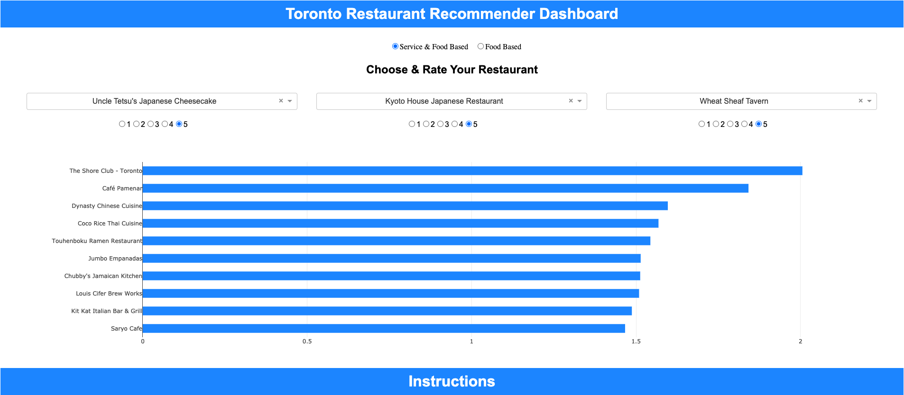

# Toronto Restaurant Recommendation Engine

## Project Description

The analysis explored the Yelp business reviews data set (url: https://www.yelp.com/dataset).

Filtering for only restaurants and culinary businesses in Toronto, topic modeling was used to cluster data and mine for service-standard reviews. Once the clusters had been generated, two recommendations were created using singular value decomposition (SVD) to create representative latent features of the restaurants, and with the latent features, cosine similarity was used to generate predictions given user restaurant inputs and ratings. 

The two recommendation engines can be defined as the following:

1) Recommendation engine for all-standard based reviews and ratings (service and food) 
 &nbsp;&nbsp; * all-standard topic model clusters included
2) Recommendation engine for food-standard based reviews and ratings 
 &nbsp;&nbsp; * service-standard topic model clusters reviews not included

**Note** - The analysis assumed the star ratings were due to the context of the review. For example, if the content of the review was about food and received a five-star rating, the high rating, for the most part, would be due to the quality of the restaurant's food.

Having completed the above, a recommendation dashboard app using plotly and dash was created and deployed to Heroku https://food-dash-app.herokuapp.com/ (**Username**: data, **Password**: analyst, **Note**: the app takes a few seconds to load). The dashboard allows the user to have the choice if he/she wants to be recommended restaurants basis all-standards (service, food, etc.) or simply basis food-standards. The recommendation dashboard app returns 10 recommendations.

Anyone looking to explore and get a deeper look into Toronto's restaurants can use this app.

## Methods Used

1) Descriptive Statistics - used for preliminary data exploration.
2) Topic Modeling - Used to cluster reviews by their context.
3) Singular Value Decomposition (SVD) - used to create two restaurant recommendation engines basis all standards or food standards. 
4) Cosine Distances - used to measure similarities between latent features of restaurants.

## Results 

### Descriptive stats after cleaning and data preprocessing 

* **number of businesses** - 911
* **number of users** - 4,045
* **number of reviews** - 100,763
* **review dates** - 2008 - 2019 

### Topic modeling

* **Topic0 AKA Topic1** - Service
* **Topic1 AKA Topic2** - Food
* **Topic2 AKA Topic3** - Food
* **Topic3 AKA Topic4** - Food

All four topics appear to represent large proportions of the reviews they were assigned to, demonstrating the quality of the topics generated.

Topic0 AKA Topic1                     |  Topic1 AKA Topic2
:------------------------------------:|:------------------------------------:
             |  

Topic2 AKA Topic3                     |  Topic3 AKA Topic4
:------------------------------------:|:------------------------------------:
             |  

### Singular Value Decomposition

**All-Standards test results**:

  * RMSE - 0.96
  * MAE - 0.75

**Food-Standards test results**:

  * RMSE - 0.89
  * MAE - 0.69
  
## Dashboard

<strong>App User Name:</strong> data  <strong>App Password:</strong> analyst  <strong>Note -</strong> the dashboard takes a few seconds to load

* Deployed to Heroku here: https://food-dash-app.herokuapp.com/

* **User Name** - data
* **Password** - analyst

## Technologies 

1) Python 
2) Jupyter Notebook
3) Anaconda Environment
4) Pyspark

## Order of Analysis

1) **Topic_Modeling.ipynb**
2) **Singular_Value_Decomposition_Recommendation_Engine.ipynb**
3) **Singular_Value_Decomposition_Recommendation_Engine_Food.ipynb**
4) **Plotly_Dash_Recommendation_Dashboard.ipynb**

## Directory Files

1) **Data_Preprocessing.ipynb** - Cleaning and preprocessing large data using pyspark.
2) **Recommendation_Dashboard_Data_Prep.ipynb** - Preprocessing data to accomodate the recommendation dashboard.
3) **Topic_Modeling.ipynb** - Topic modeling dashboard.
4) **Singular_Value_Decomposition_Recommendation_Engine.ipynb** - SVD model for all review standards.
5) **Singular_Value_Decomposition_Recommendation_Engine_Food.ipynb** - SVD model for food review standards.
6) **Plotly_Dash_Recommendation_Dashboard.ipynb** - Plotly and dash code for the recommendation dashboard.
7) **SVD_Model.pkl** - All-standard SVD model.
8) **SVD_Model_Food.pkl** - Food-standard SVD model.
